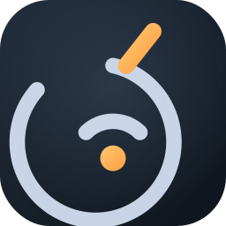
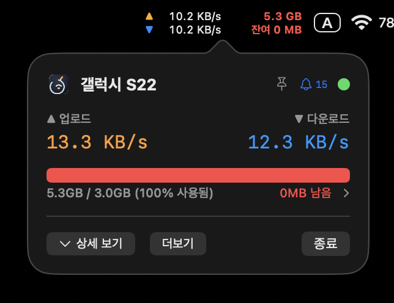
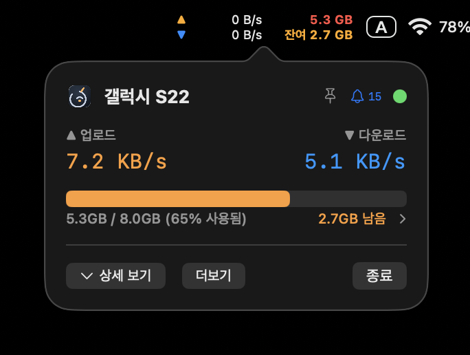
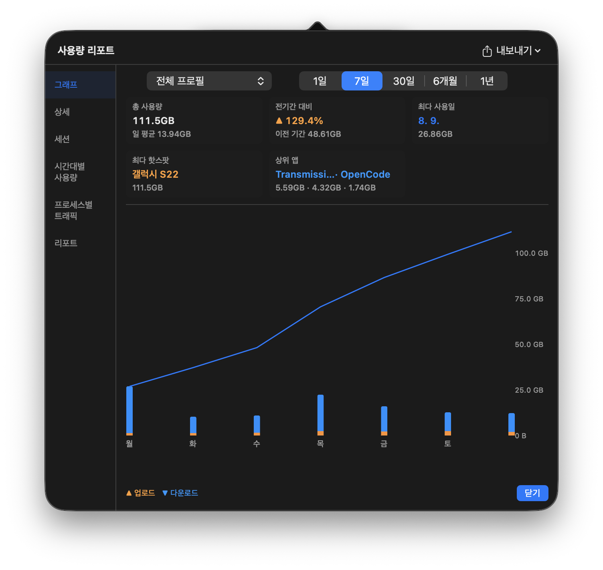

<!--
  TetherLens — Wi-Fi 데이터 사용량을 잡아먹는 모든 메가바이트를 추적하라.
  메뉴바에 숨어서, 당신의 핫스팟 데이터가 어디로 새는지 낱낱이 까발린다.
-->

<p align="center">
  
</p>

<h1 align="center">TetherLens 🔭</h1>

<p align="center">
  <b>테더링 데이터 낭비를 잡아먹는 macOS 메뉴바 감시 카메라</b><br>
  시골 인터넷에서 갤럭시 S22 핫스팟의 소중한 GB, <b>한 바이트도 놓치지 않는다.</b>
</p>

<p align="center">
  
  
  
  
</p>

<p align="center">
  <a href="https://github.com/BoraSarang/TetherLens/releases/latest/download/TetherLens-macOS.zip">⬇️ macOS에서 다운로드</a>
  ·
  <a href="https://github.com/BoraSarang/TetherLens/releases/latest">릴리스 보기</a>
  ·
  <a href="docs/CHANGELOG.md">변경 이력</a>
  ·
  <a href="README_EN.md">English</a>
</p>

---

핫스팟으로 인터넷을 쓸 때, 이 질문들은 늘 **미궁입니다**:

> 오늘 얼마나 썼지? QoS에 걸려서 속도가 반토막나기 전에 알 수 없나?
> 어떤 앱이 데이터를 쏟아내는 거지?

TetherLens는 메뉴바 하나로 **실시간 현황**과 **소진 예측**, 그리고 **원인(앱별 소비)**까지 한눈에 보여줍니다.

## 🚀 핵심 기능

| 기능 | 설명 |
|------|------|
| ❤️ **메뉴바 실시간 현황** | `▼ 1.2 MB/s / ▲ 120 KB/s` 업·다운, 그리고 할당량 상태에 따라 **사용량·잔여** 또는 **신호 세기(RSSI)·지연시간**을 자동 전환해 표시. 인사이트 색(초록→빨강)으로 상태 직관 |
| 📱 **핫스팟 자동 감지** | iOS 개인용 핫스팟 ↔ Android 테더링 구분. SSID·게이트웨이·비용·BSSID를 **종합 판별**(갤럭시 모델명·`S22 HotSpot` 같은 SSID도 정확히 잡아냄)하여 프로필 자동 전환 |
| 🎯 **QoS 방지 게이지** | 오늘 사용량 vs 일일 할당량. 임계선(50/80/95/100%) 도달 시 시스템 알림 |
| 🔮 **소진일 예측** | 지금 페이스 기준 할당량 바닥 예상일을 대시보드 카드로 표시 |
| 📊 **대시보드 인사이트** | 총/일평균, 전기간 대비, 최다 사용일·핫스팟, 상위 앱 — 상황이 보이는 리포트 |
| 📈 **그래프 고도화** | 시간대/요일별 세분화, 누적 라인, 할당량 임계선 |
| 📍 **GPS/IP 위치 추적** | 연결 위치(GPS·IP) 지도 핀 + 이동 이력 타임라인 |
| 🛰️ **연결 품질 모니터링** | 게이트웨이 + 외부(8.8.8.8) Ping RTT. 3패킷 교차 검증으로 **거짓 끊김 없이** 실제 위반만 경고, 복구 자동 감지 |
| 🚫 **스마트 절약 모드** | 핫스팟 감지 시 `softwareupdate` off·`tmutil` off·Apple 업데이트 서버 차단으로 데이터 절약 |
| 🌐 **DNS 프리셋** | 1.1.1.1 / 8.8.8.8 프리셋 적용, 시스템 네트워크 설정 즉시 변경 |
| 🔌 **앱별 트래픽** | `nettop` 기반으로 어느 앱이 얼마나 쓰는지 실시간 순위 + 아이콘 툴바로 차단·제외·초기화 |

**배터리를 헛돌리지 않게** — 시스템 슬립 시 폴링 일시중지, 팝오버 닫힘 시 tick 중지, 타이머 tolerance 적용.

---

## 🖥️ 미리보기

| 팝오버 (요약 모드) | QoS 방지 게이지 | 사용량 리포트 |
|--------|--------|--------|
|  |  |  |

---

## ⚙️ 설치

1. [TetherLens-macOS.zip](https://github.com/BoraSarang/TetherLens/releases/latest/download/TetherLens-macOS.zip) 다운로드 → 압축 해제 → `TetherLens.app`을 `응용 프로그램`으로 이동
2. **미확인 개발자 경고** 시 터미널에서 한 줄 실행:
   ```bash
   xattr -rd com.apple.quarantine /Applications/TetherLens.app
   ```
3. 첫 실행에서 알림·위치 권한 요청 — **위치 권한은 GPS 통계에만 선택 사항**

---

## 🛠️ 개발

```bash
swift build                               # 빌드
swift test                                # 단위 테스트 실행
./scripts/build-macos.sh debug            # 디버그 앱 번들 + 즉시 실행
./scripts/build-macos.sh release          # 배포 빌드 + zip 산출
./scripts/battery-profile.sh -d 60        # 배터리/CPU 프로파일 측정
```

- **네이티브 스택**: Swift 6 + AppKit + SwiftUI, SQLite 기반 자체 저장소. 크로스플랫폼 프레임워크 없음.
- **문서**: [`PRD`](docs/PRD.md) · [`DESIGN`](docs/DESIGN.md) · [`CHANGELOG`](docs/CHANGELOG.md) · [`TODO`](docs/TODO.md)

---

<p align="center">
  <sub>
    테더링 한 KB 한 KB가 데이터 한계를 만졌다고 서러워하지 않게 — TetherLens가 지켜봅니다.
    <br>© 2026 <a href="https://github.com/BoraSarang">BoraSarang</a>
  </sub>
</p>